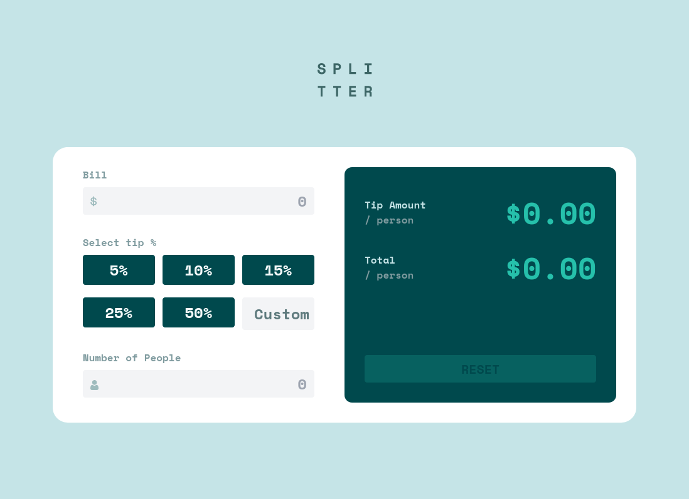
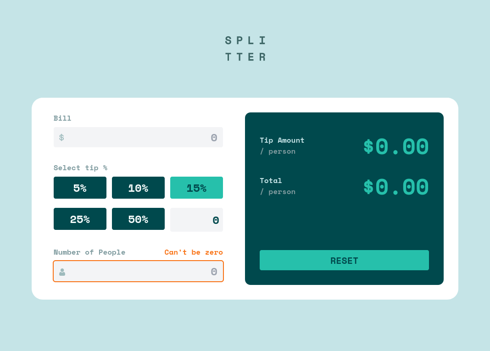

# Frontend Mentor - Tip calculator app solution

This is a solution to the [Tip calculator app challenge on Frontend Mentor](https://www.frontendmentor.io/challenges/tip-calculator-app-ugJNGbJUX). Frontend Mentor challenges help you improve your coding skills by building realistic projects.

## Table of contents

- [Overview](#overview)
  - [The challenge](#the-challenge)
  - [Screenshot](#screenshot)
  - [Links](#links)
- [My process](#my-process)
  - [Built with](#built-with)
  - [What I learned](#what-i-learned)
  - [Continued development](#continued-development)
  - [Useful resources](#useful-resources)
- [Author](#author)
- [Acknowledgments](#acknowledgments)

## Overview

### The challenge

Users should be able to:

- View the optimal layout for the app depending on their device's screen size
- See hover states for all interactive elements on the page
- Calculate the correct tip and total cost of the bill per person

### Screenshot




### Links

- Live Site URL: [](https://trinhlehainam.github.io/tipcalculatorchallenge/)

## My process

### Built with

- Semantic HTML5 markup
- CSS custom properties
- Flexbox
- CSS Grid
- Mobile-first workflow
- [React](https://reactjs.org/) - React framework
- [Tailwind CSS](https://tailwindcss.com/) - CSS framework

### What I learned

- I learned how to use google font API.

```css
@import url(https://fonts.googleapis.com/css2?family=Space+Mono:wght@400;600;700&display=swap);
```
- I learned how to use React context to pass global state to all children components.

```ts
// App.tsx
<InputContext.Provider value={inputContext}>
...
</InputContext.Provider>

// selectip.component.tsx
const { bill, setBill } = useContext(InputContext);
```

- I learned how to avoid bug when checking state's value.

```tsx
// from
setSelectedTip && customTip && setSelectedTip(customTip);
// to
setSelectedTip && (customTip !== undefined) && setSelectedTip(customTip);
```

- I learned how to set root path for Create React App build project correct by setting homepage attribule in package.json to '.'

```package.json
{
    ...
    "homepage": ".",
    ...
}
```

### Continued development

### Useful resources

- [Zelda Inventory UI](https://dev.to/flagrede/how-to-replicate-the-zelda-botw-interface-with-react-tailwind-and-framer-motion-part-1-298g) - This help me how to use React Context and add custom color in tailwind.config.js file.


## Author

- Frontend Mentor - [@trinhlehainam](https://www.frontendmentor.io/profile/trinhlehainam)
- Twitter - [@namtrile](https://www.twitter.com/namtrile)

## Acknowledgments
